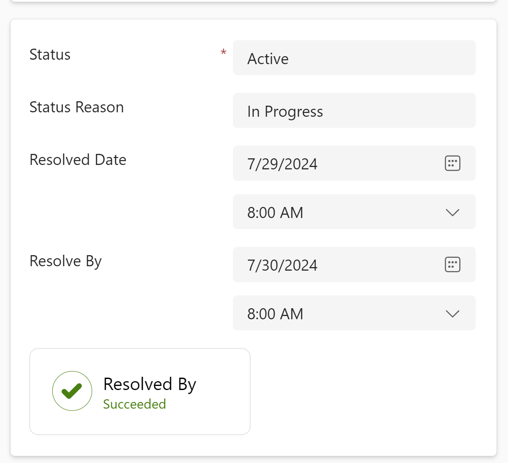
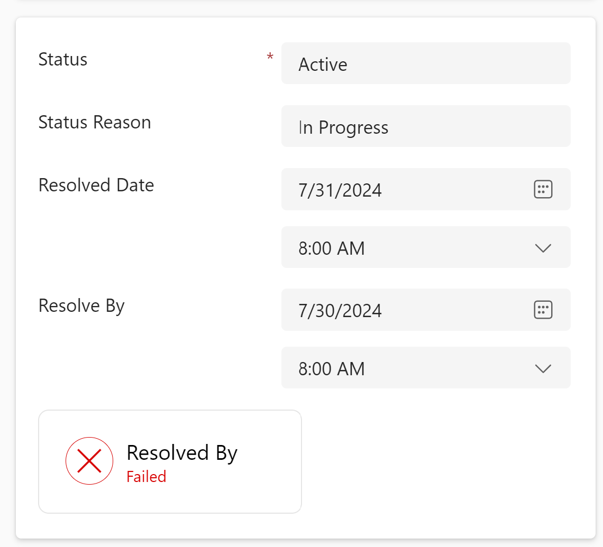
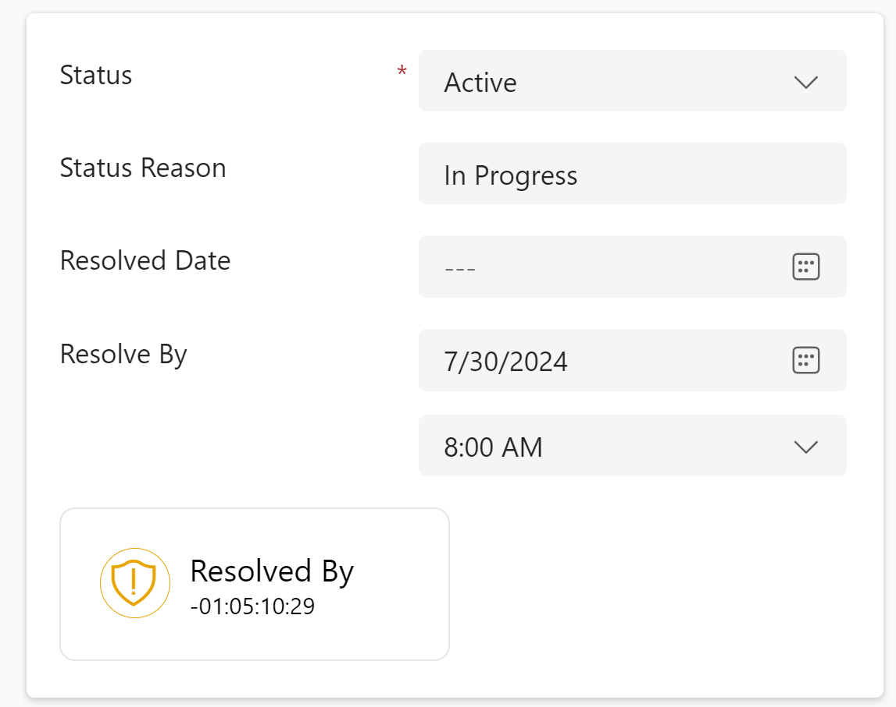
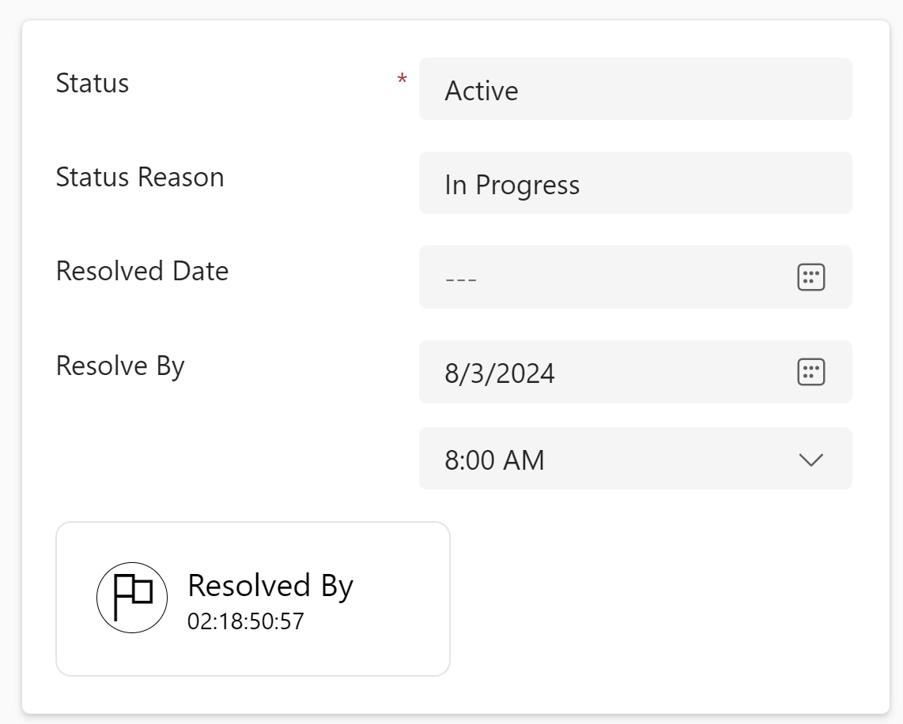
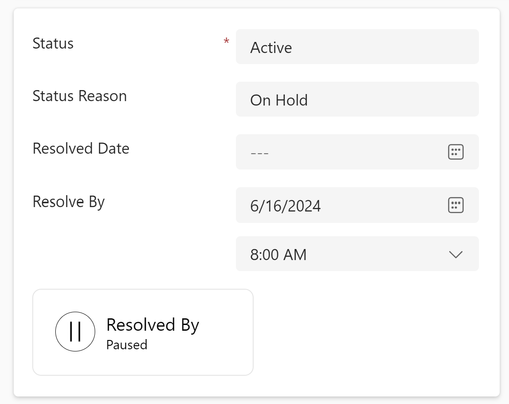

# codebug-countdown-pcf
The purpose of the pcf control is to show a timer which counts down to a target date. if the target has already been passed then it will show count negative. for the timer component, the control uses the `react-countdown` component found in [this](https://www.npmjs.com/package/react-countdown) npm repository.

## Property Specification

| Property Name | Datatype  | Default value | Required | Usage  | Description |
|--|--|--|--|--|--|
| `targetDate`  | `DateAndTime.DateAndTime` | N/A | Y | Bound | The date field the control will countdown to |
|`completionDate`|`DateAndTime.DateAndTime` | N/A| N | Bound | Date Field for the completion (If Exists)|
|`fieldName`|`SingleLine.Text`| Resolved By | Y |input|The Label of the Control|
|`pausedField`|`OptionSet`|N/A| N |input | OptionSet containing the paused pause option|
|`pausedValue`| `Whole.None` | N/A | N |input |The optionset value for the paused field for which the control will show pause state|

## Business logic
* If value of the `pausedField` is same as the as the `pausedValue`, then show paused.
* else
	* if the `completionDate` is null. [meaning the record is not completed yet]
		* if the `targetDate` is greater than the current date, then show expired
		* else show progressing
	* else
		* if the `targetDate` is greater than the `completionDate`, then show failed
		* else show succeeded

## Design
| State  | Design |
|--|--|
| Success |   |
| Failed |  |
| Expired |  |
| Progressing |  |
| Paused |  |
